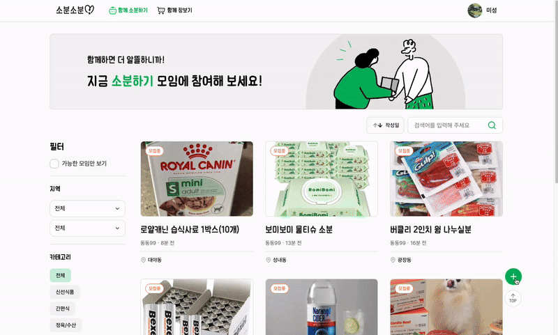
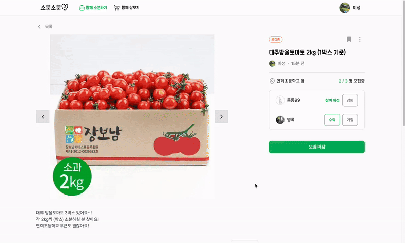
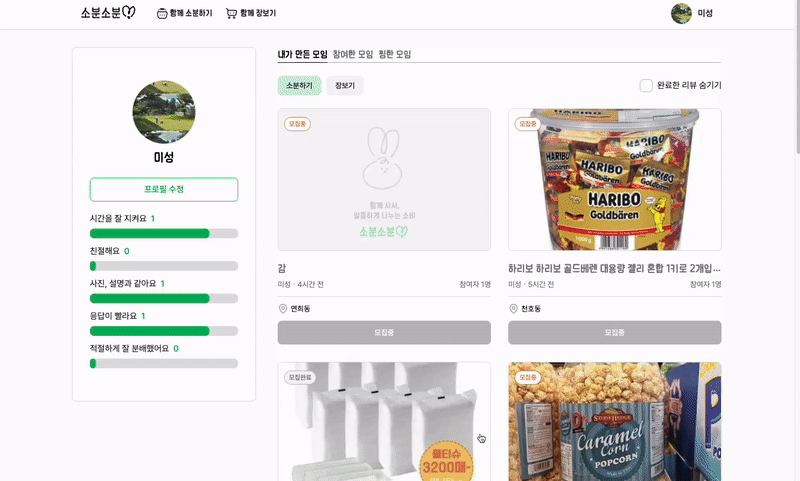

  
지역 기반 공동구매 및 쉐어링 서비스
  <h1>함께 사서 알뜰하게 나누는 소비, 소분소분</h1>

## 🗂️ 목차

1. [**서비스 소개**](#1)
2. [**주요 기능**](#2)
3. [**기술 스택**](#23)
4. [**주요 기능 데모 영상**](#4)
5. [**프론트엔드팀 소개**](#5)
6. [**개발 기간**](#6)

 

## 💁🏻 서비스 소개

함께 사서 나누는 소비 방식을 통해 개인의 비용 부담을 완화하고, 자원 낭비를 줄이는 효율적 소비를 할 수 있는 서비스를 제공한다.

🔗 [서비스 바로가기](https://soboon-client-seven.vercel.app) 
🎨 [Storybook 바로가기](https://68eda0866f99441886bc2330-tmjtfcyxaq.chromatic.com) 
📄 [최종 발표 자료 바로가기](https://www.canva.com/design/DAG3haIPqI8/9ahNJvvufzcwZtLiJcx--w/view?utm_content=DAG3haIPqI8&utm_campaign=designshare&utm_medium=link2&utm_source=uniquelinks&utlId=h4f0cfd3e28)

 

## 💡 주요 기능

- 소분/장보기 모임 생성: 함께 구매하고 나누는 모임 개설
- 댓글 소통: 주최자와 참여자 간의 대화 및 조율
- 모임 관리: 참여 신청, 확정, 거절, 강퇴 등 운영 기능 제공
- 모임 탐색: 카테고리, 지역, 키워드 기반 검색
- 마이페이지: 주최 및 참여 모임 조회와 리뷰 작성
- 간편 로그인: 카카오 계정 연동 로그인

 

## ⚙️ 기술 스택

- 코어: `TypeScript`, `Next.js`
- 스타일링: `Tailwind CSS`
- 상태 관리: `Zustand`
- 테스트: `Jest`
- 디자인 시스템: `Storybook`
- CI/CD: `GitHub Actions`

 

## 🎥 주요 기능 데모 영상

|                                                 소분 모임 등록                                                 |
| :------------------------------------------------------------------------------------------------------------: |
|  |

|                                  소분 모임 댓글 (대댓글, 비공개 댓글 작성 및 수정)                                  |
| :-----------------------------------------------------------------------------------------------------------------: |
|  |

|                                      소분 모임 참여 확인 (확정, 거절, 강퇴, 마감)                                      |
| :--------------------------------------------------------------------------------------------------------------------: |
|  |

|                                            리뷰 작성 및 조회                                            |
| :-----------------------------------------------------------------------------------------------------: |
|  |

 

## 🏄🏻‍♀️ 프론트엔드팀 소개

|                                  이름                                  |                                               프로필                                                | 개발 내용                                                                                                                                                                                                                                                                              |
| :--------------------------------------------------------------------: | :-------------------------------------------------------------------------------------------------: | :------------------------------------------------------------------------------------------------------------------------------------------------------------------------------------------------------------------------------------------------------------------------------------- |
| <a href="https://github.com/keeprok" target="_blank">이영록 (팀장)</a> |  | 마이페이지 내 프로필 조회 및 수정 구현 리뷰 조회/작성 기능 구현 마이페이지 내 참여한/주최한/찜한 모임 조회 공용 컴포넌트 개발 + 스토리북 및 테스트 코드 작성 Husky를 통한 커밋 단계 코드 검사 자동화 검색 기능                                                          |
|   <a href="https://github.com/kdh990315" target="_blank">김동현</a>    |  | 소분/장보기 모임 목록/상세페이지 기능 구현 공용 컴포넌트 개발 + 스토리북 및 테스트 코드 작성 프로젝트 초기 환경 구성 및 App Router·Jest 테스트 환경 세팅 SEO 최적화 next의 미들웨어 기반 인증 라우팅 제어 next-bundle-analyzer를 활용한 번들 사이즈 분석 및 최적화      |
|   <a href="https://github.com/misung-dev" target="_blank">류미성</a>   |  | 소분/장보기 모임 수정 및 삭제 기능 구현 Storybook 환경 세팅 및 Chromatic 자동 배포 설정  공용 컴포넌트 개발 + 스토리북 및 테스트 코드 작성 Jest를 활용한 컴포넌트 테스트 코드 작성 next-bundle-analyzer를 활용한 번들 사이즈 분석 및 최적화 Vercel을 이용한 서비스 배포 |
|  <a href="https://github.com/jihee1103" target="_blank"> 최지희 </a>   |   | 소셜 로그인 (카카오톡) 기능 구현 프로필 생성 페이지 구현 공용 컴포넌트 개발 + 스토리북 및 테스트 코드 작성                                                                                                                                                                       |
|                                                                        |

 

## 📅 개발 기간

2025.09 ~ 2025.11 (2개월)
